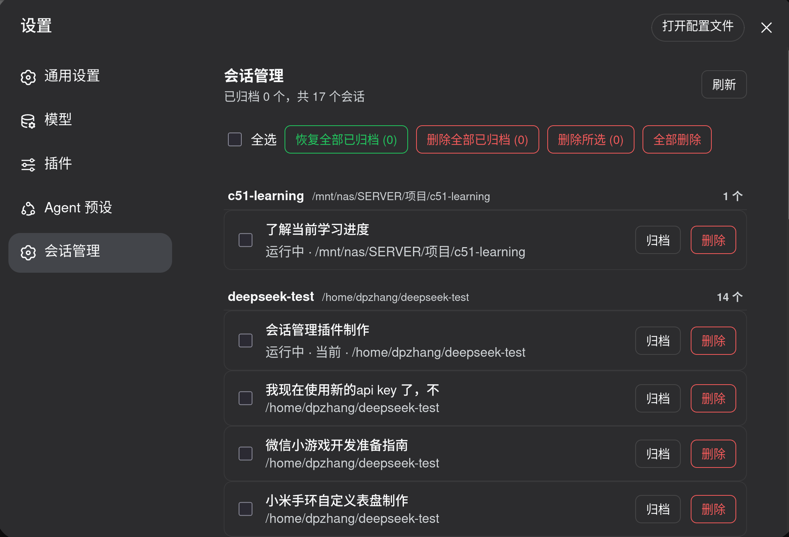

# dsh Session Manager（会话管理插件）

DeepSeek Harness 的**部署级插件**：在 Web 设置的「会话管理」页中，统一管理所有会话 —— 支持**恢复归档**、**删除会话**、**按工作区分组**、**多选/全部批量操作**。作为部署级插件常驻，进程重启后自动加载。

## 功能

- **恢复归档**：把已归档会话移回侧边栏（通过平台 `host/archived-sessions-changed` 帧实时同步所有浏览器）。
- **删除会话**：移除工作区记账 + 归档隐藏 + **删除磁盘日志**（冷会话立即删；运行中的会话隐藏后，等它停止自动删除）。
- **批量删除**：多选删除、删除所选、**删除全部已归档**、全部删除。
- **批量恢复**：恢复全部已归档。
- **按工作区分组** 的清单（含未分组），每行可 归档 / 恢复 / 删除（删除需二次确认）。
- **状态持久化**：已删/待删记录写入 `.session-manager-state.json`，插件/进程重启后不复活。

## 界面预览

「会话管理」设置页（按工作区分组、多选、批量操作）：



## 目录结构

```
dsh-session-manager/
├── readme.md                      # 本文档
├── LICENSE
├── package.json                   # 项目根元信息（可选）
├── packages/
│   ├── session-manager/           # Host 服务  @deepseek-ai/dsh-session-manager
│   │   ├── src/{index.ts, types.ts}
│   │   ├── tsconfig.json / tsdown.config.ts
│   │   └── scripts/rewrite-remote-zod.mjs   # 构建后处理（见下）
│   └── client-ui-session-manager/ # 浏览器设置页  @deepseek-ai/dsh-client-ui-session-manager
│       ├── src/{index.ts, client/index.ts}
│       └── tsconfig.json / tsdown.config.ts
└── dist/                          # 构建产物（lib/，可被部署直接拷贝安装）
    ├── session-manager-lib/
    └── client-ui-lib/
```

## 架构

- **Host 侧**：`SessionManagerService extends TypertRemoteService`，通过 `@Remote` 暴露
  `list / restore / restoreMany / archive / deleteSession / deleteSessions / deleteAllArchived`。
  直接操作 workspace 存储域（归档集合 + 工作区记账）、调用持久化层定位并删除会话日志、维护待删队列。
  Remote 贡献随包的 `./typert` 由 `typert-loader` 自动注册。
- **客户端侧**：注册 `settings.section` 的「会话管理」页，通过 `ctx.remote.sessionManager.*` 调用 Host。
  Remote namespace 由 `dsh-api-remotes` 统一挂载（平台标准路径）。

## 构建

前置：Node 18+、pnpm 9+；已在 **dsh 仓库**工具链内构建（typert 生成、client bundle 依赖其 tsdown 配置）。

```bash
# 在 dsh 仓库根目录（含本插件源码的 checkout）执行
pnpm install
pnpm build:lib:host     # Host 构建 + typert（生成 typert.host.js / typert.remote-client.js）
# 然后对 session-manager 的产物执行一次远程层 zod 重写（让浏览器 bundle 内联 zod）：
node packages/session-manager/scripts/rewrite-remote-zod.mjs
pnpm build:lib:client   # 客户端 bundle
```

每次 Host 重建后都需重跑 `rewrite-remote-zod.mjs`（它把生成的 remote-client 由 `import { z } from 'zod'`
改写为 zod 具名导入，配合 tsdown 的 `zod` ESM alias，避免本仓库 rolldown 把 zod 留成外部 `require("zod")`
导致模块表缺失）。构建产物在 `dist/`（本项目已含一份当前构建结果）。

## 安装（一键，bundle 形态）

本仓库根目录本身就是一个 **bundle 包**（`@dm-odyssey/dsh-session-manager`），带 `dsh.bundle.patch`
声明与自带的 `cordis.patch.yml`。因此可用 dsh 的插件命令一键安装。

**从 GitHub**
```bash
# 已打 tag（如 v0.1.0）后安装：
dsh plugin --profile web add 'git@github.com:DM-Odyssey/dsh-session-manager.git#v0.1.0'
# 或用 HTTPS 地址（需 Personal Access Token）：
# dsh plugin --profile web add 'https://github.com/DM-Odyssey/dsh-session-manager.git#v0.1.0'
```

**从内网 Gitea**
```bash
dsh plugin --profile web add 'ssh://gitea@192.168.0.22:2222/dpzhang/dsh-session-manager.git#v0.1.0'
```

**从本地目录**
```bash
dsh plugin --profile web add /absolute/path/to/dsh-session-manager
```

`dsh plugin ... add` 会在 profile 里执行 `pnpm add`（把 bundle 及其两个子包装进 node_modules），
并自动把识别为 bundle 的包加入 `dsh.profile.bundles`；启动时 bundle 自带的 `cordis.patch.yml`
作为一层补丁挂载 `session-manager` 与 `client-ui-session-manager` 两行。无需手工 patch/symlink。

> 发布说明：bundle 的 `dependencies` 以 `file:` 指向本地两个子包，适合本地安装/联调。
> 发布到远端（GitHub/Gitea）前，应把这两个 `file:` 依赖改成已发布的版本 spec（见“推送 GitHub”）。
> 子包 `@deepseek-ai/dsh-session-manager`、`@deepseek-ai/dsh-client-ui-session-manager` 对
> `@deepseek-ai/*` 与 `react` 的依赖均为 peer（`*`），由 dsh 部署环境提供，无需随包发布。

### 手工方式（备选，与该 bundle 等价）

若不便用 `dsh plugin add`，也可手工放置：把两个子包的 `lib`+`package.json` 拷到
`~/.local/lib/node_modules/@deepseek-ai/dsh/node_modules/@deepseek-ai/<包名>/`，写
`~/.dsh/profiles/web/cordis.patch.yml`（两行 insert，见下），并确保 profile 的
`node_modules/@deepseek-ai/<包名>` 是指向全局包的符号链接，重启。

### 回滚

```bash
dsh plugin --profile web remove @dm-odyssey/dsh-session-manager   # 或 pnpm remove
# 或：编辑 ~/.dsh/profiles/web/package.json，把该 bundle 从 dsh.profile.bundles 移出并删除依赖
rm -f ~/.dsh/profiles/web/cordis.patch.yml
# 重启 dsh web
```

## 使用

1. 在侧边栏（原生三点菜单）把不需要的会话「归档」；
2. 打开 **设置 → 会话管理**；
3. 单个：每行 **归档 / 恢复 / 删除**（删除需二次确认）；
4. 批量：**全选**、**恢复全部已归档 (N)**、**删除全部已归档 (N)**、**删除所选 (N)**、**全部删除**。

删除立即在所有页面隐藏会话；磁盘日志冷会话当场删除、运行中的在停止后（刷新页面或 60 秒扫描）自动清除。

## 数据与安全

- 删除 = 工作区记账移除 + 归档集合隐藏 + 日志目录删除；日志路径经严格校验（只允许删除以会话 id
  命名的 `session.jsonl[.zstd]` 所在目录）。
- 「已删除 / 待删」记录写入 `<workspace>/.session-manager-state.json`；删除该文件即重置记录。
- 归档集合里的孤立 id（对应日志已不存在的会话）会被当作清除项处理，不再反复出现。

## 回滚

```bash
rm ~/.dsh/profiles/web/cordis.patch.yml
rm -rf ~/.dsh/profiles/node_modules/@deepseek-ai/dsh-session-manager \
       ~/.dsh/profiles/node_modules/@deepseek-ai/dsh-client-ui-session-manager
rm -rf ~/.local/lib/node_modules/@deepseek-ai/dsh/node_modules/@deepseek-ai/dsh-session-manager \
       ~/.local/lib/node_modules/@deepseek-ai/dsh/node_modules/@deepseek-ai/dsh-client-ui-session-manager
# 重启 dsh web
```

## 推送（GitHub 与内网 Gitea 同时保留）

本仓库配置了两个远端：

```bash
git remote -v
# origin   ssh://gitea@192.168.0.22:2222/dpzhang/dsh-session-manager.git   (内网 Gitea)
# github   git@github.com:DM-Odyssey/dsh-session-manager.git               (GitHub)
```

推送代码到两个远端：

```bash
git push origin main    # 内网 Gitea
git push github main    # GitHub
```

打 tag 并推送到两个远端：

```bash
git tag v0.1.0
git push origin v0.1.0
git push github v0.1.0
```

> 首次推 GitHub 前：先在 github.com 建仓库 `dsh-session-manager`，并把本机 SSH 公钥
> （`~/.ssh/id_ed25519.pub`）加到 GitHub → Settings → SSH and GPG keys。
> 验证：`ssh -T git@github.com` 应回 `Hi <你>! ...`。

## 许可

MIT。
